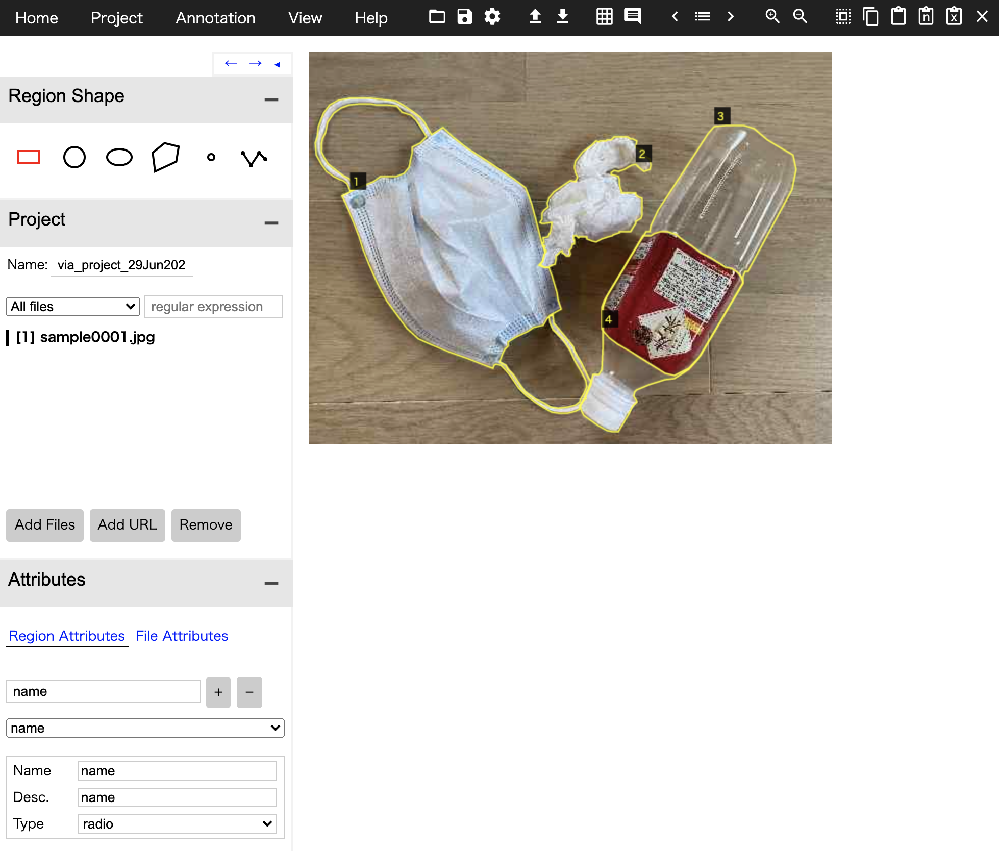

# Converting VGG Image Annotator [(VIA)](http://www.robots.ox.ac.uk/~vgg/software/via/) json to [COCO](https://cocodataset.org/#home) json format

VIA is an image tool for visualizing and editiing object detection datasets. It allows the user to determine quality of annotations to verify the integrity of a dataset. It gives users the ability to edit or remove incorrect or malformed annotations. The user can also create new annotations to increase the size of the dataset.

VGG created this tool to be used with their VIA formatted object detection annotations. I create the program converting the VIA format to Microsoft's Common Objects in Context([COCO](http://cocodataset.org/#home)) format.

※ This program is just for polygon objects and radio categories.

# Annotation Sample([Sample image](tutorial/images/sample0001.jpg))


# Installation
1. Clone this repository
2. Install dependencies
    ```bash
    pip install -r requirements.txt
    ```

# Getting Started
```
# Convert VIA json to COCO json
# python main.py original_format images_dir original_json config_yaml

python main.py via tutorial/images tutorial/jsons/sample.json /tutorial/configs/config.yaml
```
```
# Convert COCO json to VIA json

python main.py coco tutorial/images tutorial/jsons/sample_coco.json /tutorial/configs/config.yaml
```

# License
VIA is an open source project released under the [BSD-2 clause license](https://gitlab.com/vgg/via/blob/master/LICENSE).